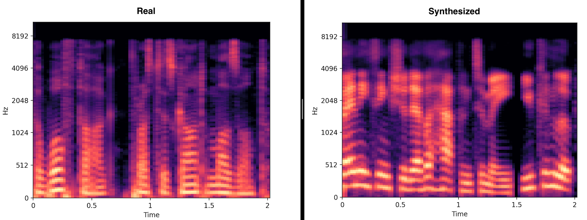
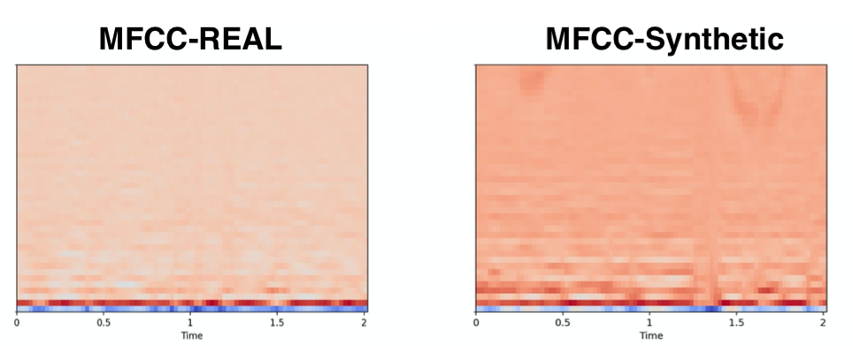
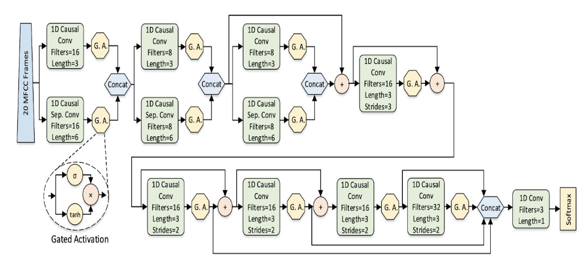

# Synthetic-Voice-Detection

## Dataset

Dataset -  http://bil.eecs.yorku.ca/datasets/

* Total of 17,870 utterances.
* Training Set - Contains 77.3% of the dataset, used to train the ML model. Gender and class balanced.
* Validation Set - Contains 15.58% of the dataset, used to validate the accuracy of the ML model. Gender and class balanced.
* Generalization Testing - Contains 6.68% of the dataset. Contains only voices from one unseen algorithm(Google TTS Wavenet) and unseen real voices. Gender and        class balanced. Used to check if the model has successfully learnt to generalize.

## Feature Extraction

Extracting MFCCs essentially summarises the frequency distribution across a window size, this makes it possible to analyse both frequency and temporal characteristics of a sound wave. I have used the Librosa library, alongside a custom script to extract the MFCCs of all the audio files in the dataset and saved the processed dataset as a HDF5 file. This downsized the dataset by about 5 times.

 

## Network Architecture

Resources  - https://arxiv.org/pdf/1812.00149.pdf

## Future Tasks:
- [ ] Data Augmentation - more data will help the model generalise with higher levels of accuracy. Augmentations such as noise injection, time shifting, pitch           change and speed change could be implemented with Numpy & Librosa.
- [ ] Exploring the ​for-rerec​ dataset and p​ ossible merge​ with the ​for-2seconds dataset, will help the model in situations where the attacker may play the synthetic speech with one device and record it with another device. This will make the model more resilient.
- [ ] Exploring Constant-Q transform(CQT) instead of MFCC for feature extraction. This could be implemented with Librosa.
- [ ] Transfer Learning with model architectures such as Inception and MobileNet with ImageNet weights - this might improve the classification accuracy, however these are relatively large models and might sacrifice speed in a real-time classification scenario.

